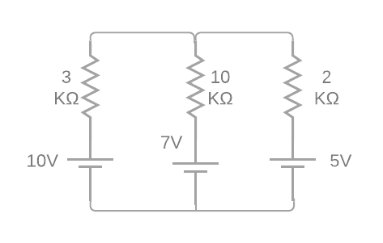
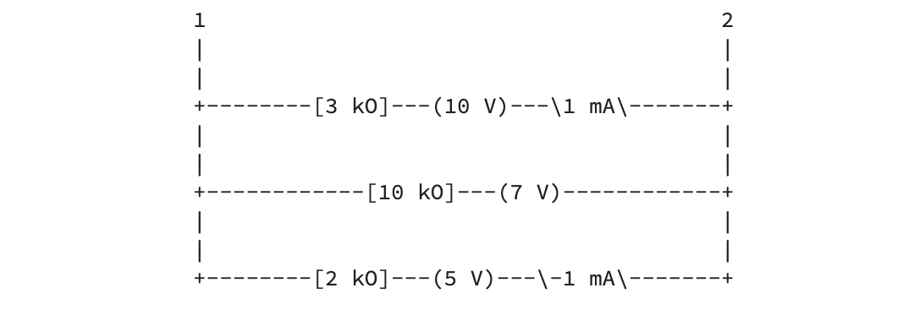
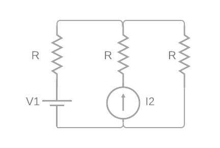
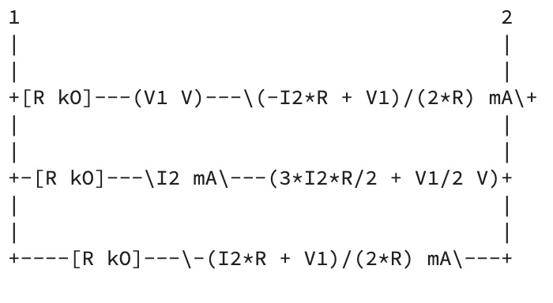
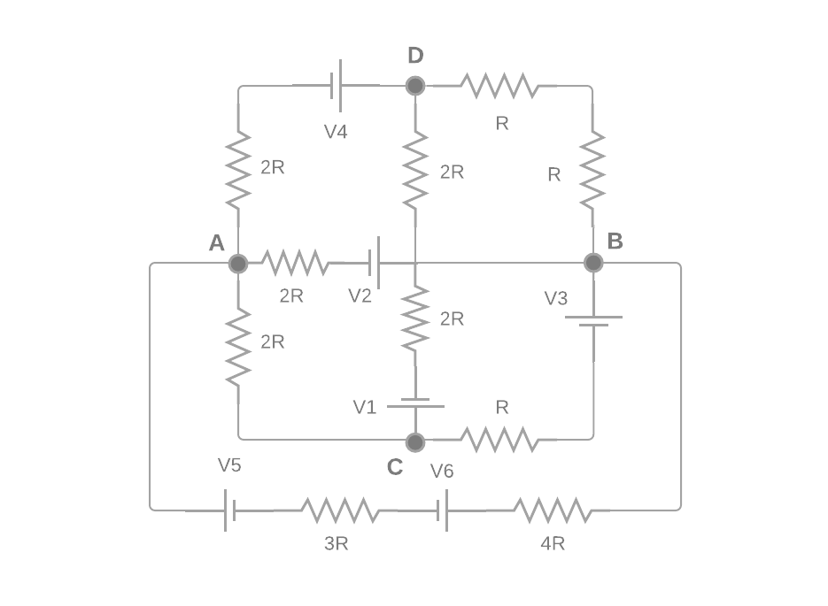
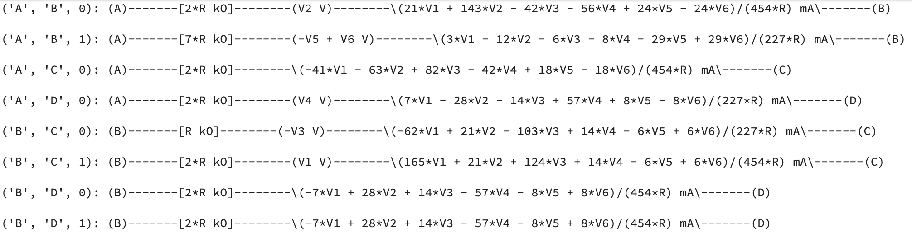

## CIRCUIT SIMULATOR

Basic electrical circuit simulator. That's how I define a recently written Python Class which is capable of solving linear circuits (V, I, R variables), by using the well-knowned Kirchhoff Laws.

### Features:

1. Initiallize circuits by passing its branches as atributtes. The circuit is modelled throught an **internal multigraph**: branch components as the corresponding edge atributtes.

2. **Automatic Kirchhoff update**, if possible, to determine the unknown variable for each branch: given a voltage source and a resistance, computes that branch intensity, or the potential difference of the generator if it's a current source. Also can determine the branch resistance if having a voltage AND a current source, but only if the Kirchhoff laws allow it: doesn't solve unstable circuits.

3. Circuit **str representation** using both `branch_view()` or `circuit_view()` methods. The first one as the standard, plots circuit branches in a ascending order, with their components. The second one is a more complete circuit view, layering the branches with column nodes, but only garantees a correct label for short (< 4 nodes) circuits.

4. Also have **useful methods** as `potential_difference()`, used for getting the potential difference between two circuit nodes.

5. And the better one... have **symbolic support**! Uses SimPy library for all computations, so can actually perform symbolic operations. That means, we can pass branch's values as knowed variables like 'V1' or 'R', so the targetted variable will get also a symbolic expression as result. That's so useful for college tasks, or general circuits where we don't know some of the branch's actual values.

### Limitations:

The class is under-development-when-I-have-time, so I'm still thinking on how to improve it. For the moment, circuit branches only supports the three basic linear components: resistances, source generators and current generators, in DC.

### Examples:

I've provided three circuits as examples, all resolved using the same procedure.

**1. DC NUMERIC KIRCHHOFF**

Simple Kirchhoff circuit, with only three voltage sources and three resistances. The normal solving procedure involves checking for all nodes, branches and meshes of the circuit, and then build a linear system from using Kirchhoff Laws.



With `Circuit` class, you only have to specify the branches of the circuit by passing its components:

```
example1 = Circuit()
example1.add_branch((1, 2), R = 3, V = 10)
example1.add_branch((1, 2), R = 10, V = 7)
example1.add_branch((1, 2), R = 2, V = 5)
```

Then, we just have to plot the circuit, by using the default `print()` or the convenient view:

```
print(example1)
```




**2. DC SYMBOLIC KIRCHHOFF**

Another simple DC Kirchhoff circuit, but this time with symbolic values. Note that we have a current generator, though the commands are the same:



```
example2 = Circuit()
example2.add_branch((1, 2), R = 'R', V = 'V1')
example2.add_branch((1, 2), R = 'R', I = 'I2')
example2.add_branch((1, 2), R = 'R', V = 0)
print(example2)
```



__A few remarks__:

- The symbolic operators or variables have to be passed as strings. Then, the SimPy module applies a symbolic transformation over them.
- The voltage of the second branch is the unknown, so we have to pass the resistance and intensity values.
- The third branch has to assure `V = 0`. The class doesn't assume a default value for any variable, so needs exactly two input components.

**3. DC EXTENDED KIRCHHOFF**

Finally, let's solve a more complicated one:



Here, I've previously marked circuit nodes with single characters, from 'A' to 'D'. It's useful to use numbers or characters for nodes.
Furthermore, when adding new branches, the connected nodes have to satisfy the order '<', because of a convention.

```
example3 = ElectricalCircuit()
example3.add_branch(('A', 'B'), R = '2 * R', V = 'V2')
example3.add_branch(('A', 'C'), R = '2 * R', V = 0)
example3.add_branch(('A', 'D'), R = '2 * R', V = 'V4')
example3.add_branch(('B', 'C'), R = 'R', V = '- V3')
example3.add_branch(('B', 'C'), R = '2 * R', V = 'V1')
example3.add_branch(('B', 'D'), R = '2 * R', V = 0)
example3.add_branch(('B', 'D'), R = '2 * R', V = 0)
example3.add_branch(('A', 'B'), R = '7 * R', V = 'V6 - V5')
```

As the circuit view used in the two previous examples is too complex for complicated circuits, we will use the branch view, witch offers a more readable view of branches connections:

```
print(example3.branches_view())
```



### Comments:

Of course, any comment, advise or support is highly appreciated.
